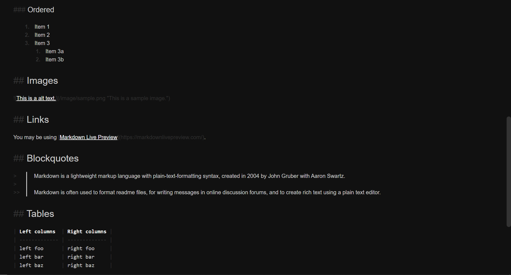

# Markdown Inline Formatting

A markdown-only text editor

## Features

- Inline formatting for markdown synatx
- Half of the code yeeted from the internet
- No `save` or `save as` option
- Very crappy `undo` and `redo` shortcuts
- Extremely buggy user interface

## Usage

1. Open up `Markdown-Inline-Formatting/index.html` in a web browser
2. Edit the provided template to see live syntax highlighting

## Feature Requests

just don't.
